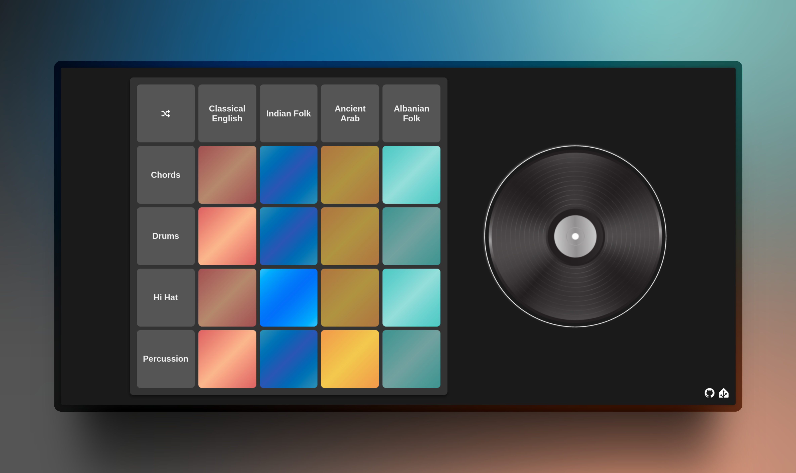

# **Beathaven**

> [♫ Try it out ](https://beat-haven.netlify.app/)  


[](https://beat-haven.netlify.app/)

**Beathaven** is a revolutionary music-making web app created during the **2023 WDCC x SESA Hackathon**, themed **"Rewriting History!"**. This app was built with the goal of making music creation effortless, accessible, and enjoyable for everyone, no matter their skill level.

Imagine you’re a musician in the 17th century. You’ve spent hours composing your latest masterpiece, but the king hears it and—*off with your head!* The music was *that* bad. Fast forward to today, and music production is still tough for many. But **Beathaven** rewrites that history! With access to **65,000+ melodies** from all over the world, you can make epic tunes in a few taps—no royal executions required.


## **Features**

- **65,000+ Global Melodies**: A vast library of timeless music samples from all over the world, across genres and historical eras.
- **Effortless Music Creation**: Create music with ease, even if you've never made a song before.
- **Interactive Sound Pads**: A grid of sound pads that allow you to tap into different instruments, rhythms, and melodies instantly.
- **Genre-Based Samples**: Choose samples based on the genre you're in the mood for.
- **Creative Freedom**: Infinite possibilities for music production, all at your fingertips.


## **Technologies**

- **Interface**: HTML, CSS, JavaScript
- **Audio Libraries**: Web Audio API


## Installation

To get started with **Beathaven**, follow these simple steps:

1. **Clone the repository**:
   ```bash
   git clone https://github.com/your-username/beat-haven.git
   ```
2. **Navigate to the project folder:**
   ```bash
   cd beat-haven
   ```
3. **Open the app:** Open beatmaker.html in your preferred web browser.
This is a clean, simplified installation guide since the app is entirely frontend-based and doesn't require additional setup. Let me know if it's working foryou now!

## Contributing

Feel free to fork, improve, and submit pull requests! Contributions are welcome to make Beathaven even more awesome.